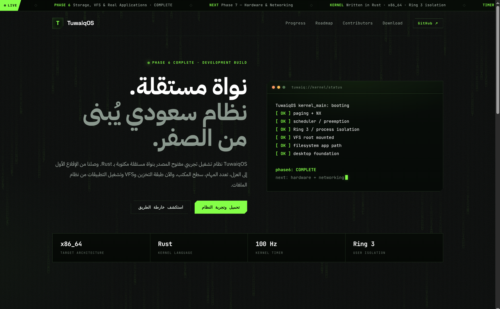

TuwaiqOS Website

The official website for TuwaiqOS, a Saudi open source operating system built from the kernel to the desktop.

## Preview

Visit TuwaiqOS Website:
tuwaiqos.site.je

My Role

Web Developer • Communications Channels Manager

I contributed to the development and maintenance of the TuwaiqOS website and helped manage the project’s digital communication channels.

My contributions include:

• Developing and maintaining the project website
• Building and improving the website’s user interface
• Organizing and presenting project information
• Managing the TuwaiqOS Telegram channel
• Supporting the project’s digital presence and community communication

About TuwaiqOS

TuwaiqOS is a Saudi open source operating system project focused on building an operating system from the kernel to the desktop.

Technologies

• HTML
• CSS
• JavaScript

Project

This website is part of the main TuwaiqOS project and is maintained as part of the project’s source repository.
